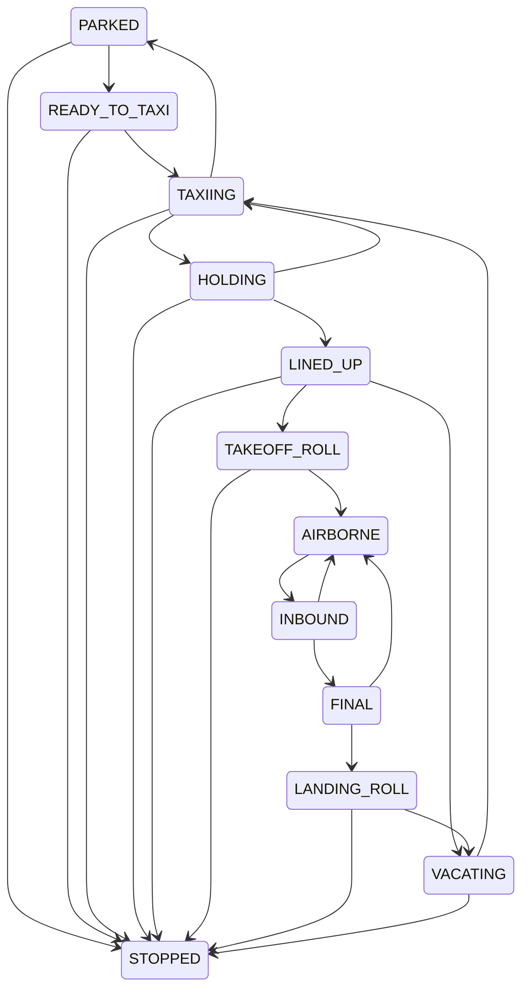

# FP-010: Aerodrome traffic state

## Scope and application boundary

FP-010 supplies immutable aircraft, aerodrome and runway state for the Portable ATC
Radar Trainer's aerodrome/tower prototype. `TrafficService.initialise` maps a validated
scenario during INITIALISING, checking its ID, version and content hash against the
session. `TrafficService.transition` accepts explicit state transitions during RUNNING.
The service uses the existing event repository/unit of work; no database table,
configuration, REST route or WebSocket message is added. These are internal application
hooks for subsequent simulation wiring. The current browser does not yet show traffic.

Movement, schedules, clearance execution, separation checks, AI and radio are subsequent
packets. State changes preserve position, heading, speed, altitude and route progress.
Occupancy is explicit membership, not an inference from coordinates or a clearance.

## Canonical fields and scenario mapping

Aircraft retain ID, callsign, position and ordered route from the scenario. Aircraft
type defaults to GENERIC; wake category is unspecified. Heading, ground speed, altitude
and route progress start at zero because scenario schema 1.0 does not supply these
values. They are placeholders, including for INBOUND and FINAL, not simulated motion.
Clearance identity/state start at null/NONE; pilot profile is default and response
state is IDLE. Future clearance/radio producers own changes to these fields.

Geometry uses the scenario's local metre coordinates, runway threshold/end/width,
taxiway points and holding-point runway/taxiway references. References and unique IDs
are validated. Runway designator initially equals its scenario ID; schema 1.0 has no
separate operational designator. Runways start OPEN with empty membership, version 1.
Aircraft start at version 1. Route runway references establish the assignment; routes
referencing multiple distinct runways are rejected as ambiguous.

PARKED, TAXIING, HOLDING, INBOUND and FINAL are the supported scenario initial states.
HOLDING requires exactly one holding point at the initial position that also appears
in the route, with a consistent runway assignment. Later HOLDING transitions explicitly
name a valid holding point associated with the assigned runway. They do not move the
aircraft to that point; movement validation belongs to subsequent simulation work.

## Canonical state table

| State | Meaning | Allowed next states | Runway membership |
| --- | --- | --- | --- |
| PARKED | Stationary at parking | READY_TO_TAXI, STOPPED | None |
| READY_TO_TAXI | Ready for ground movement | TAXIING, STOPPED | None |
| TAXIING | Ground taxi phase | HOLDING, PARKED, STOPPED | None |
| HOLDING | At an identified holding point | TAXIING, LINED_UP, STOPPED | None |
| LINED_UP | Positioned on assigned runway | TAKEOFF_ROLL, VACATING, STOPPED | Required |
| TAKEOFF_ROLL | Departure roll | AIRBORNE, STOPPED | Required |
| AIRBORNE | Airborne outside inbound/final phase | INBOUND | None |
| INBOUND | Inbound before final | FINAL, AIRBORNE | None |
| FINAL | Final approach; go-around permitted | LANDING_ROLL, AIRBORNE | None |
| LANDING_ROLL | Arrival roll | VACATING, STOPPED | Required |
| VACATING | Leaving runway, not yet clear | TAXIING, STOPPED | Required until TAXIING |
| STOPPED | Terminal stopped aircraft | None | Retains prior membership |

Unlisted edges, including same-state requests, reject without mutation. STOPPED is
terminal under this initial policy; recovery/reset is not provided by FP-010. Aircraft
STOPPED is distinct from session STOPPED. Multiple members may occupy a runway; this
records reality for future safety evaluation rather than authorizing conflicting use.

## Versions, occupancy and atomic events

`change_aircraft` validates legal edges and advances the aircraft version exactly once.
`occupancy` is the single membership policy. It checks the expected runway version,
adds/removes only the named aircraft and advances the runway version only for a material
membership change. Repeating a membership value at the current version is a no-op.
Stale versions reject even for a duplicate membership request. Closed runways reject new
entries but permit removal. Existing occupants are never implicitly cleared.

`transition_traffic` returns a new immutable state and typed facts. Entry and exit require
the expected runway version and produce the aircraft fact followed immediately by its
occupancy fact. Phase changes while already occupying retain membership/version; STOPPED
on the runway also retains membership. Changing runway assignment while occupied fails.

The service emits `aircraft.spawned`, `aircraft.state_changed` and
`runway.occupancy_changed`. Initialisation emits one spawn per aircraft; the first carries
the shared aerodrome geometry. All facts in one command share a correlation ID. The
existing SQLite transaction commits the entire batch, session projection, idempotency
record and outbox intent together. Builders allocate no time/identity and perform no I/O.
An observed event-sequence guard rejects concurrent history changes even when session
version is unchanged. Traffic events advance event sequence and entity versions, but
preserve session lifecycle version and simulation time.

Same-key retries return the original committed result after later commands or restart;
different inputs with that key conflict. Full traffic state is rebuilt from events.
Replay rejects stale before-values, duplicate geometry/spawns, missing or orphan occupancy
effects and inconsistent final membership. No traffic snapshot table is introduced.

## Completion evidence matrix

`tests/backend/test_traffic.py` covers:

| Contract | Evidence |
| --- | --- |
| Legal and illegal state edges, terminal behavior | Independent 12-by-12 transition matrix (144 cases) |
| Immutable state and policy | Frozen nested geometry and read-only transition mapping |
| Scenario mapping | Reference geometry/identity/routes/defaults; distinct initial states; HOLDING resolution |
| Geometry and field integrity | Duplicate IDs, invalid holding references, geometry mismatch, scalar and clearance coherence |
| Membership authority | Add/remove, duplicate no-op, sorting, other-member preservation, closed runway |
| Entity versions | Stale/boolean aircraft and runway versions; unchanged original input |
| Departure/arrival phases | Entry, takeoff release, go-around, landing, vacating release, stopped occupancy |
| Typed facts | Envelope round trips, first-sequence rejection, unrelated mutation and no-op fact rejection |
| Durable effects | Scenario initialisation, paired authoritative events, restart replay, original retry, outbox |
| Failure atomicity | Injected second-event failure rolls back all four persistence tables |
| Replay integrity | Missing/orphan occupancy rejection; incomplete append writes nothing |
| Lifecycle and concurrency | Wrong phase/reinitialisation rejection, stale-history guard, pure builder |

Published event schema/catalogue fixtures include these three newly activated contracts.
Existing history without traffic remains valid. Older readers cannot parse these events;
after writing traffic history, keep a compatible reader or restore a verified pre-upgrade
backup separately. Never remove traffic events to force an older reader to accept history.
Future state-policy/schema changes require explicit compatibility review and migration/ADR
where historical semantics change. AB-04 failed-history replay remains outside this packet.
